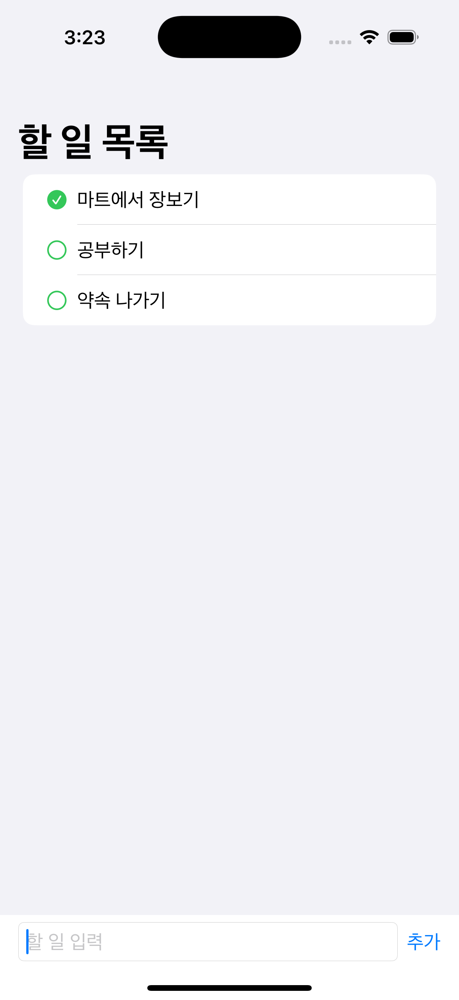
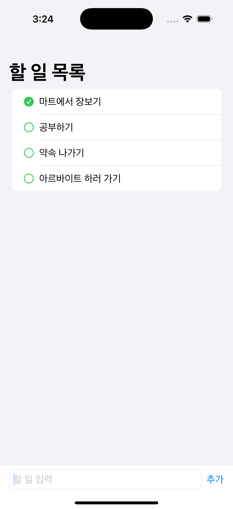
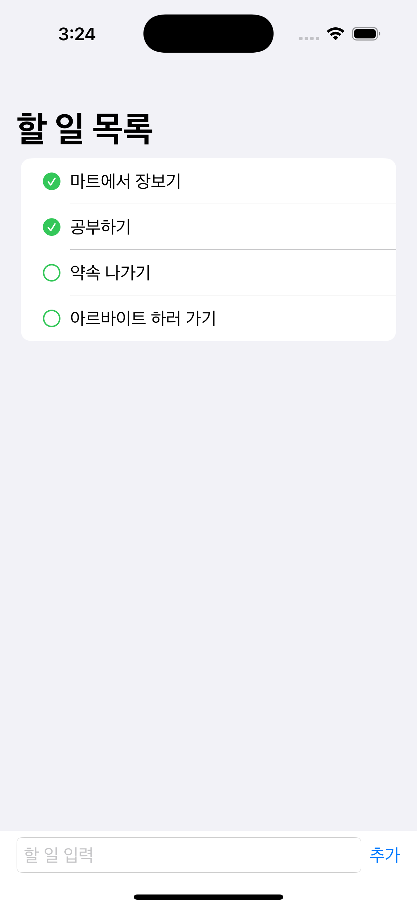
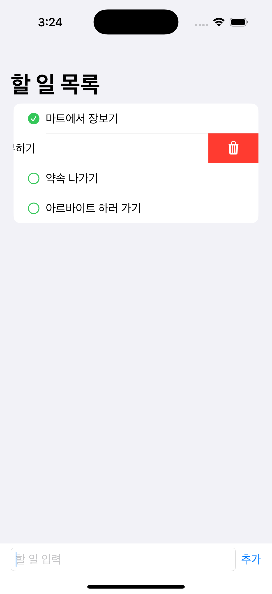
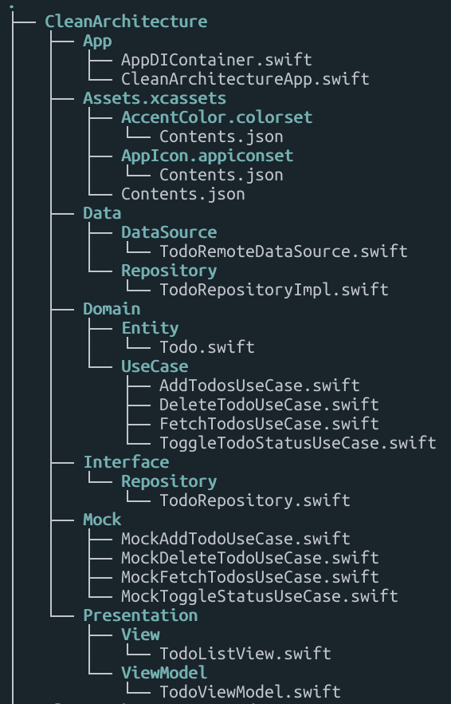

# CleanArchitecture

## 1. 앱 목적
간단한 할 일 목록 앱을 통해 SwiftUI + MVVM 패턴 위에 Clean Architecture를 결합한 구조를 실제로 구현하고, 의존성 주입(DI), 관심사 분리(SRP), 테스트 가능성(Mock) 등을 학습 및 실전 적용합니다.

## 2. 주요 화면
<table>
  <tr>
    <td align="center">할 일 목록</td>
    <td align="center">할 일 추가</td>
    <td align="center">할 일 완료</td>
    <td align="center">할 일 삭제</td>
  </tr>
  <tr>
    <td></td>
    <td></td>
    <td></td>
    <td></td>
  </tr>
</table>

## 3. 기술 스택

## 3. 디렉토리 구조

## 4. Q&A

### Q1. Repository Interface를 왜 따로 정의하나요?
> 추상화를 통해 UseCase가 API/DB 구현을 몰라도 동작할 수 있도록 하기 위해서.

### Q2. UseCase란?
> 앱이 제공하는 하나의 기능 단위. ViewModel에서 호출되며 핵심 로직을 수행.

### Q3. UseCase를 왜 프로토콜로 나눠요?
> DIP 만족 + Mock 테스트 가능 + 유연한 아키텍처 확장성을 위해.

### Q4. Repository Interface를 Data에 두면 안 되나요?
> ❌ UseCase가 Data에 의존하게 되므로 DIP 위반. Interface 계층에 위치해야 함.

### Q5. DIP(Dependency Inversion Principle)란?
> 고수준 모듈이 저수준 모듈에 의존하지 않고, 둘 다 추상화에 의존해야 한다.

### Q6. ViewModel을 View에서 직접 생성하면 왜 안 되나요?
> 테스트 어려움 + DIP 위반. 외부에서 주입받아야 유연함.

## 5. 정리

